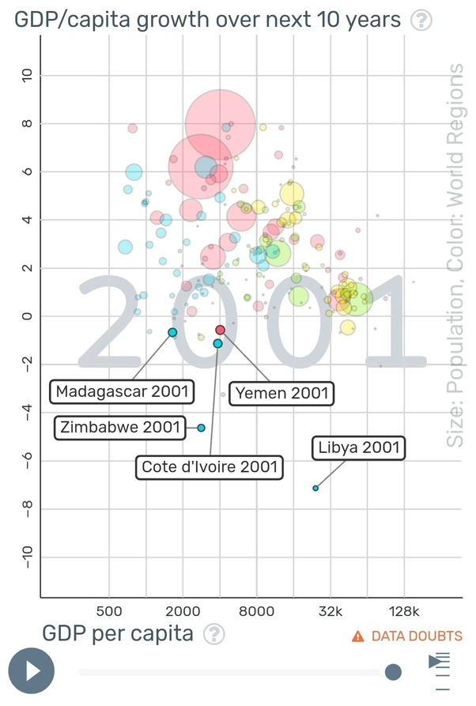

*Réponse publiée [sur Quora](https://fr.quora.com/Est-ce-que-l-enfer-est-r%C3%A9ellement-sur-terre-Si-oui-Pourquoi-les-pays-riches-appauvrissent-les-pays-pauvres-tandis-que-l-enfer-est-un-lieu-de-tourments-o%C3%B9-les-gens-souffrent-s%C3%A9v%C3%A8rement/answer/Dr-Goulu)*

Si vous regardez les faits, les pays riches n'appauvrissent plus les pays pauvres depuis les années 1970 environ.

Comme vous le voyez sur cette figure, à part une dizaine de pays en guerre ou crise politique majeure, tous les pays ont eu une croissance de leur PIB par habitant positive, donc leurs citoyens s'enrichissent (en moyenne…) et même plus vite que ceux des pays européens (en jaune) ou les USA (en vert entre le 0 et le 1 de 2001)

La figure est faite avec le génial [Gapminder](https://www.gapminder.org/tools/#$model$markers$bubble$encoding$y$data$concept=gdppercapita_growth_over_next_10_years&source=sg&space@=geo&=time;;&scale$domain:null&zoomed@:-10&:35.99;&type:null;;&x$scale$zoomed@:923.19&:57463.95;;;&frame$value=2001;;;;;&chart-type=bubbles&url=v1)et en cliquant sur ce lien puis sur le bouton play, vous verrez que depuis leur indépendance, la plupart des pays d'Asie, puis d'Amérique du Sud, et maintenant d'Afrique ont rejoint puis obtenu une croissance du PIB par habitant supérieure à ceux de l'Europe et d'Amérique du Nord .

Vous voyez même "à l'œil" que les pays "riches" à droite du graphique ont une croissance plus faible que les pays "pauvres", qui les rattrapent donc assez vite.

La conséquence de ceci est qu'il n'y a plus de fossé entre pays "riches" et "pauvres" depuis les années 1990 environ, comme le montre très bien Hans Rosling dans plusieurs conférences extraordinaires, par exemple celle ci:

[https://www.ted.com/talks/hans_r...](https://www.ted.com/talks/hans_rosling_the_best_stats_you_ve_ever_seen?utm_campaign=tedspread&utm_medium=referral&utm_source=tedcomshare)

Si votre pays est un enfer, c'est probablement parce que les richesses y sont très mal réparties, comme c'était le cas en Europe à la fin du 19ème siècle, pas parce que d'autres vous spoilent.

C'est votre tâche désormais de développer votre pays de l'intérieur, en le rendant stable et équitable. Les européens et étazuniens ont désormais d'autres chats à fouetter, et les russes et chinois ne vous aideront pas mieux que vos anciens colons.

C'est à vous seul de transformer votre enfer, peut être pas en paradis, mais en pays où la vie vaut la peine d'être vécue.

Bonne chance.
