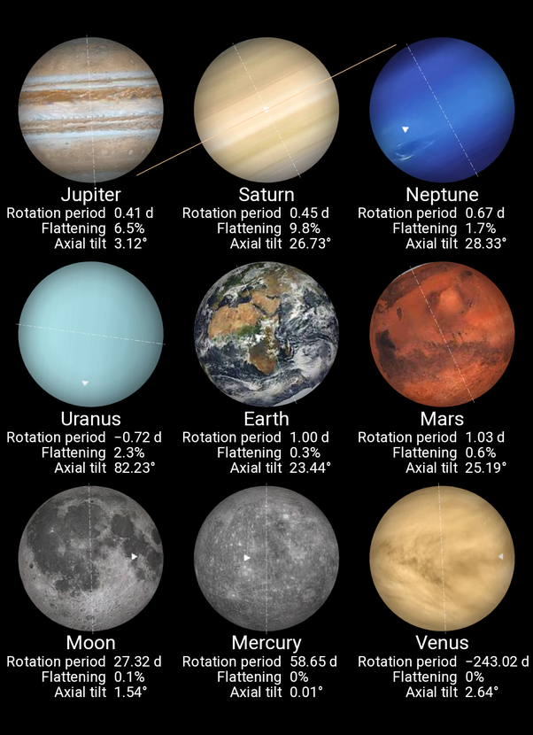

*Réponse publiée [sur Quora](https://fr.quora.com/Les-plan%C3%A8tes-du-syst%C3%A8me-solaire-sont-elles-vraiment-ronde-g%C3%A9om%C3%A9triquement/answer/Dr-Goulu)*

[L'aplatissement](w:Aplatissement) des planètes varie entre 0% pour celles qui ne tournent quasi pas sur elles mêmes (Mercure, Venus) à près de 10% pour Saturne qui est gazeuse et tourne très vite

