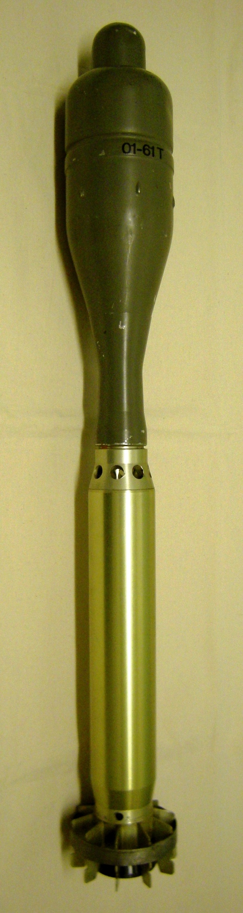

*Réponse publiée [sur Quora](https://fr.quora.com/Avez-vous-fait-des-conneries-dans-votre-jeunesse-qui-aujourd-hui-seraient-gravement-punies/answer/Dr-Goulu)*

Fabriquer des explosifs pour re-tirer des roquettes anti char de l'armée suisse retrouvées dans les alpages.

Avec le droguiste qui nous fournissait des kilos de nitrates et chlorates, on se retrouverait sans doute fichés comme organisation terroriste…

La bonne nouvelle, c'est qu'on a survécu.

