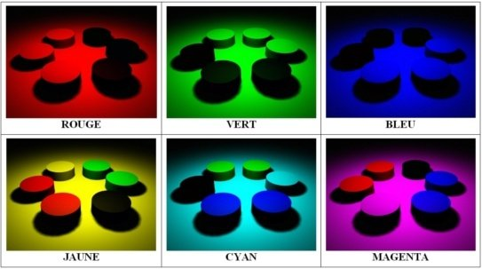

*Réponse publiée [sur Quora](https://fr.quora.com/De-quelle-couleur-est-un-objet-enferm%C3%A9-dans-une-bo%C3%AEte-en-l-absence-de-lumi%C3%A8re-Ma-pr%C3%A9c%C3%A9dente-question-%C3%A0-mal-%C3%A9t%C3%A9-pos%C3%A9e-a-propos-de-la-couleur-des-objets-lorsque-l-on-ne-les-regarde/answer/Dr-Goulu)*

Les objets non lumineux n'ont pas de couleur. Ils diffusent ou reflètent une partie de la lumière qu'ils reçoivent.

Par exemple ces objets colorés en lumière blanche

ont ces apparences quand ils sont éclairés dans chacune des couleurs correspondantes

Donc si vous n'éclairez pas les objets, ben ils ne reflèteront aucune lumière et ils seront donc noirs.

[https://www.maxicours.com/se/cou...](https://www.maxicours.com/se/cours/couleur-des-objets/)
