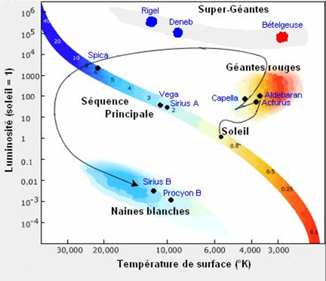

*Réponse publiée [sur Quora](https://fr.quora.com/Comment-peut-on-savoir-quune-naine-jaune-notre-soleil-va-devenir-une-g%C3%A9ante-rouge-puis-une-naine-blanche-Est-ce-purement-que-de-la-th%C3%A9orie-tout-%C3%A7a/answer/Dr-Goulu)*

Non, ça résulte de l'observation de millions d'étoiles et de leur positionnement dans le

[https://fr.wikipedia.org/wiki/Di...](w:Diagramme_de_Hertzsprung-Russell)

Il y a une extraordinaire video qui montre l'établissement du diagramme en triant simplement les étoiles d'une photo de Hubble par couleur puis par luminosité :

[https://youtu.be/mY2edzGYWyU](https://youtu.be/mY2edzGYWyU)

Yapluka expliquer pourquoi les étoiles forment ce diagramme bizarre alors qu'elles ne se distinguent que par leur masse et leur âge (qui fait varier leur composition) …

Seule explication logique : elles se promènent dans le diagramme au cours de leur existence.

Dans le cas du Soleil, en reliant les points correspondants à des étoiles d"une masse solaire, on obtient cette trajectoire dans le diagramme :

