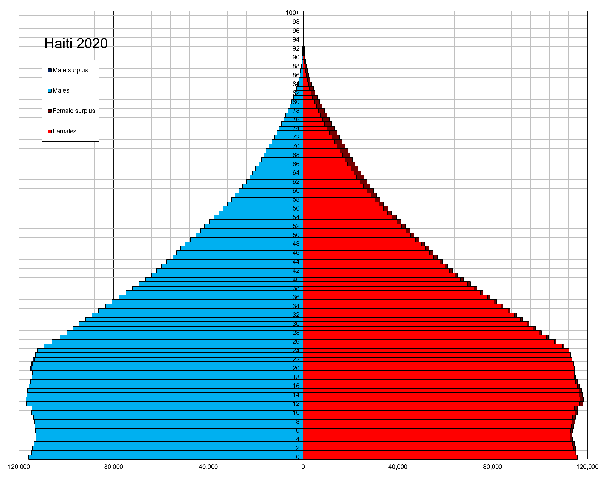

*Réponse publiée [sur Quora](https://fr.quora.com/Comment-se-fait-il-que-le-taux-de-natalit%C3%A9-soit-inf%C3%A9rieur-%C3%A0-1-et-maintenant-08-07-ou-05-en-Ha%C3%AFti-Pourquoi-et-comment/answer/Dr-Goulu)*

Le [taux de natalité](w:) se mesure en naissances pour 1000 habitants. Il valait 23.5 en 2021 en Haïti[[1]](#mUcSr). Il est de 10.7 en France.

Si vous pensiez au [Taux de fécondité](w:), le nombre d'enfants par femme, il vaut 2.87 en Haïti et 1.83 en France.

Donc je ne sais pas ce que sont vos chiffres, mais ce qui est sur c'est qu'Haiti est en pleine [Transition démographique](w:), qui se visualise par une transformation de la pyramide des âges en cylindre :

C'est une étape fondamentale du développement, donc plutôt une bonne nouvelle…

[https://fr.wikipedia.org/wiki/D%...](w:Démographie_d'Haïti)

Notes de bas de page

[[1]](#cite-mUcSr)[Perspective Monde](https://perspective.usherbrooke.ca/bilan/servlet/BMTendanceStatPays?langue=fr&codePays=HTI&codeTheme=1&codeTheme2=1&codeStat=SP.DYN.CBRT.IN&codeStat2=x)
