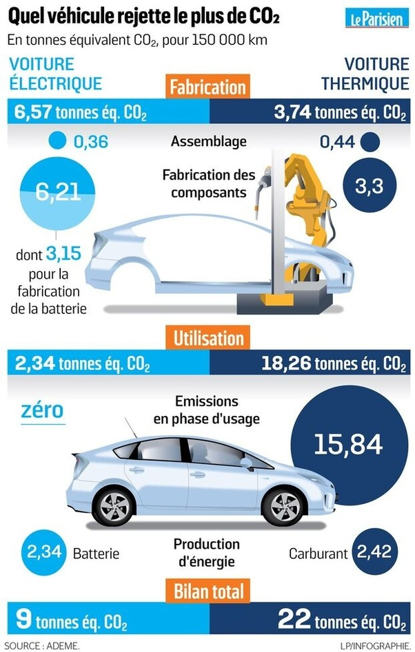

*Réponse publiée [sur Quora](https://fr.quora.com/Quelle-est-la-quantit%C3%A9-d-%C3%A9nergie-en-tonne-%C3%A9quivalent-p%C3%A9trole-par-exemple-n%C3%A9cessaire-%C3%A0-la-fabrication-d-une-voiture-%C3%A9lectrique/answer/Dr-Goulu)*

Près du double d'une voiture à essence

Puis le dixième en utilisation

Moins de la moitié sur la durée de vie

[https://www.leparisien.fr/automo...](https://www.leparisien.fr/automobile/voiture-electrique-ou-thermique-laquelle-pollue-le-plus-12-08-2019-8132190.php)
