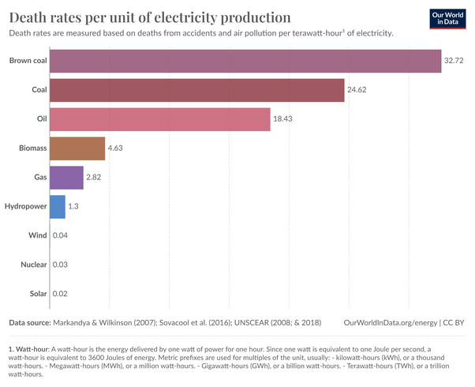

*Réponse publiée [sur Quora](https://fr.quora.com/Comment-peut-on-%C3%AAtre-favorable-au-nucl%C3%A9aire-apr%C3%A8s-des-accidents-comme-Chernobyl-ou-Fukushima/answer/Dr-Goulu)*

en sachant compter.

Source : [Death rates per unit of electricity production](https://ourworldindata.org/grapher/death-rates-from-energy-production-per-twh) et [Electricity generation and health - PubMed](https://pubmed.ncbi.nlm.nih.gov/17876910/)
