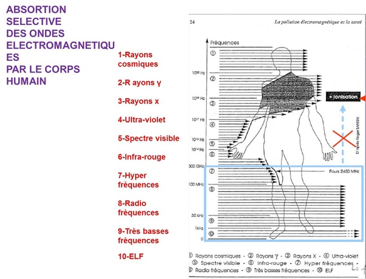

*Réponse publiée [sur Quora](https://fr.quora.com/Pourquoi-la-lumi%C3%A8re-visible-ne-traverse-pas-les-murs-contrairement-aux-ondes-radio-Est-ce-li%C3%A9-%C3%A0-la-longueur-d-onde/answer/Dr-Goulu)*

Oui, c'est lié à la longueur d'onde et aux matériaux, qui ont chacun une certaine "transparence" à certaines longueurs d'onde.

Les ondes radio traversent mal l'eau, par exemple.

Exemple du corps humain

