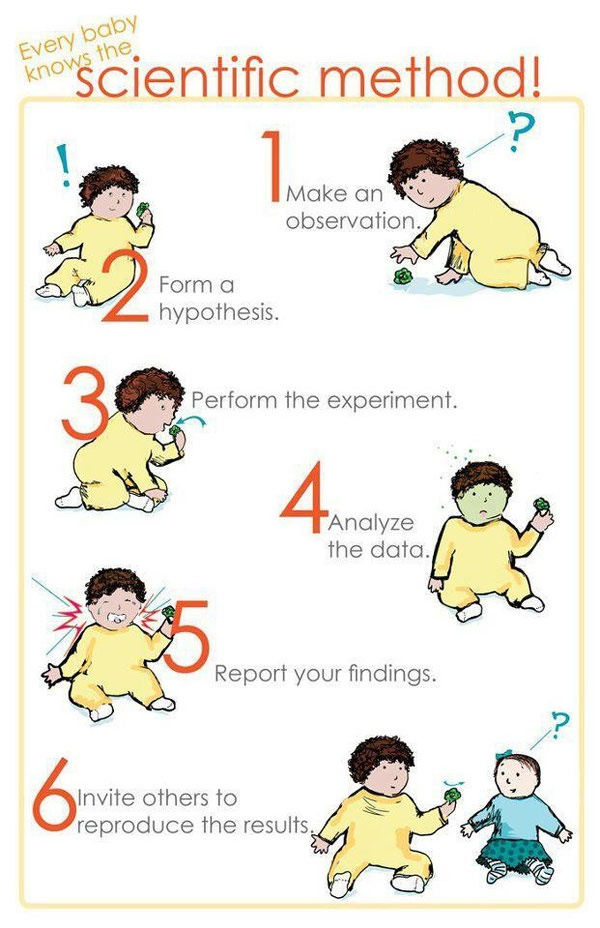

*Réponse publiée [sur Quora](https://fr.quora.com/Pourquoi-la-r%C3%A9flexion-et-l-imagination-l-emportent-sur-l-exp%C3%A9rience-quant-%C3%A0-l-avancement-des-sciences/answer/Dr-Goulu)*

Dans vos rêves !

La science n'avance que par les expériences.

La réflexion et l'imagination permettent de recoller entre elles des expériences. Dans la méthode scientifique ça s'appelle "formuler des hypothèses", mais ensuite, sans expériences de validation ces hypothèses ne valent pas tripette.

