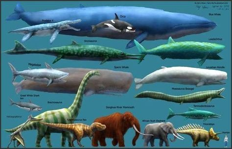

*Réponse publiée [sur Quora](https://fr.quora.com/Pourquoi-a-l-epoque-des-dinausaures-tout-etait-gigantesque/answer/Dr-Goulu)*

Parce qu'on a surtout trouvé les fossiles des rares grandes espèces qui ont vécu pendant cette très longue période, de 240 à 66 millions d'années avant nous.

Mais il y avait plein d'autres espèces de toutes tailles, dont les petites qui ont évolué en oiseaux et mammifères.

Rappelez vous que le plus grand animal ayant jamais existé est la baleine bleue, et qu'on l'a presque fait disparaître en un siècle.

