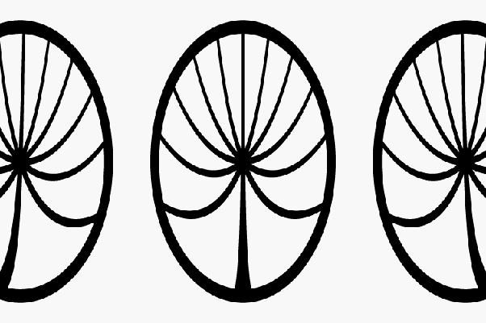

*Réponse publiée [sur Quora](https://fr.quora.com/Une-voiture-roule-%C3%A0-49999999-de-la-vitesse-de-la-lumi%C3%A8re-sur-une-piste-parfaitement-droite-Quelle-est-la-forme-de-ses-roues-vues-du-bord-de-la-piste/answer/Dr-Goulu)*

D'abord en réponse à des remarques de certaines réponses si, il serait possible de voir passer la voiture. Pas avec nos yeux, mais avec des cameras ultra-rapides. On a réussi à en faire qui prennent 10^13 images par seconde ! [[1]](#UkbOw) Donc le véhicule avancerait de 15 microns entre deux images : photo super nette, même pas de motion blur !

Ensuite à 0.5c, tout le véhicule apparaît comprimé dans le sens de déplacement du [Facteur de Lorentz](w:)qui vaut 1.15 "seulement", avec un joli [Effet Doppler relativiste](w:)qui décale les couleurs du véhicule vers le rouge à l'avant, et vers le bleu à l'arrière,

Pour les roues, dont le point de contact au sol est "immobile" et le haut de la roue se déplace à quasi la vitesse de la lumière, cet effet d'arc en ciel doit être très joli…

Pour la forme des roues, j'avoue avoir eu un doute, levé par la lecture de références comme [Rotations at the speed of light](https://www.riken.jp/en/news_pubs/research_news/rr/7016/) qui m'ont convaincu qu'elles restent elliptiques (à cause du lorentz linéaire), mais ce qui se passe de marrant à lieu au niveau des éventuels rayons de la roue, qui eux ont des vitesses "linéaires" variables. Ça donnerait ça :

Jolies simulations hélas sans effet doppler ici

[https://www.spacetimetravel.org/rad](https://www.spacetimetravel.org/rad)

Une réponse mentionne l'[Effet Sagnac](w:)mais comme la lumière ne "tourne" pas dans ce cas, je pense que c'est plutôt le [Paradoxe d'Ehrenfest](w:)qui poserait de gros problèmes à la roue, à supposer qu'elle soit faite en [Unobtainium](w:)pur, évidemment.

Ça me semble plus simple de ralentir la vitesse de la lumière, comme dans

[http://gamelab.mit.edu/games/a-s...](http://gamelab.mit.edu/games/a-slower-speed-of-light/)

(où je ne me rappelle pas qu'il y ait des roues, hélas)

(écrivez leur pour appuyer ma demande de mettre leur code en open source…)

Notes de bas de page

[[1]](#cite-UkbOw)[La caméra la plus rapide du monde fige le temps en 10 billions d’images/seconde](https://inrs.ca/actualites/la-camera-la-plus-rapide-du-monde-fige-le-temps-en-10-billions-dimages-seconde/#:~:text=Avec ses collègues, sous la,phénomènes – et même la lumière!)
