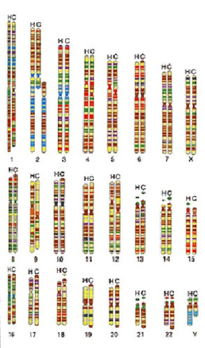

*Réponse publiée [sur Quora](https://fr.quora.com/Peut-on-dire-que-la-th%C3%A9orie-de-Darwin-est-fausse-vue-que-l-on-a-aucun-ADN-avec-les-singes/answer/Dr-Goulu)*

Voici nos chromosomes (ADN) et ceux des chimpanzés côte à côte :

96% de correspondance.

Vous voyez aussi pourquoi nous avons un chromosome (2) de moins, c'est parce qu'il correspond à la fusion de deux chromosomes de notre ancètre commun.

Nous sommes si proches des chimpanzés, des gorilles et des orangs-outans que nous les avons regroupés dans la famille des [Hominidés](w:Hominidae).
