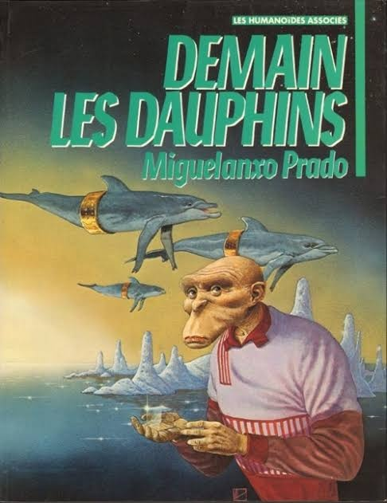

*Réponse publiée [sur Quora](https://fr.quora.com/Pourquoi-n-y-a-t-il-plus-de-bug-g%C3%A9n%C3%A9tique-dans-la-reproduction-du-singe-afin-de-cr%C3%A9er-une-nouvelle-esp%C3%A8ce-humaine/answer/Dr-Goulu)*

Il y a eu des milliers de mutations depuis la spéciation de nos ancêtres et de ceux des chimpanzés, il y a environ 5 millions d'années. Voir par exemple [Protéine Forkhead-P2 — Wikipédia](w:Protéine_Forkhead-P2) pour une des plus récentes et mieux connues.

Nous évoluons toujours, ils évoluent toujours (d'ailleurs l'apparition du fleuve Congo a provoqué la spéciation des chimpanzés et des bonobos) et nous resterons toujours cousins de la même famille, les [Hominidés](w:Hominidae).

Si nous ne les exterminons pas, peut-être qu'un jour ce sera la Planète des Singes, ou encore plus cool

Qui sait ?
