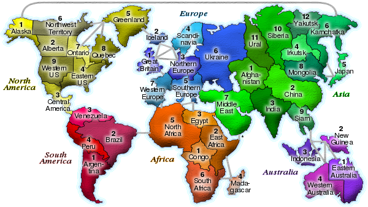

*Réponse publiée [sur Quora](https://fr.quora.com/Poss%C3%A9dez-vous-un-jeu-de-soci%C3%A9t%C3%A9-RISK-des-ann%C3%A9es-60-80-Auriez-vous-l-amabilit%C3%A9-de-photographier-le-jeu-en-bonne-r%C3%A9solution-Afin-de-bien-pouvoir-lire-le-nom-des-pays-au-moins-de-l-Europe/answer/Dr-Goulu)*

Wikipedia est votre amie

[https://fr.wikipedia.org/wiki/Ri...](w:Risk)

