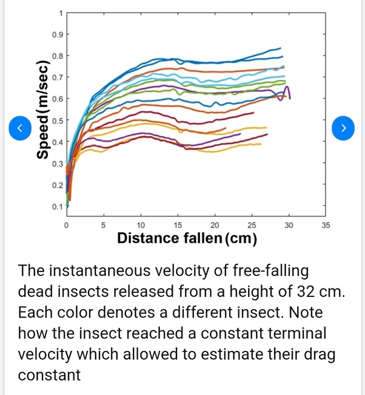

*Réponse publiée [sur Quora](https://fr.quora.com/Pourquoi-les-insectes-faisant-une-chute-de-1000-fois-leur-taille-ne-se-blessent-visiblement-pas-Se-blessent-ils-en-r%C3%A9alit%C3%A9/answer/Dr-Goulu)*

- La [Vitesse terminale](w:)d'un insecte est autour de 0.7 m/s soit environ 2.5 km/h seulement, et il l'atteint en 10 cm de chute selon cette figure tirée de cet article [[1]](#kKRWN) qui mériterait un prix igNobel :

- L'[Effet d'échelle](w:), ou "loi carré / cube" atténue encore le choc : un être 100 fois plus petit que vous est aussi 100x plus fin et 100x plus étroit, il a donc une masse 100 x 100 x 100 = 1 million de fois plus petite que vous (des milligrammes au lieu de kilogrammes), mais la section de membres n'est que de 100 x 100 = 10'000 fois plus faible. En cas de choc, les contraintes mécaniques sur son corps sont donc 100 fois plus faibles.

Un éléphant qui tombe de 1m se tue, vous vous tordez la cheville, et une fourmi ça ne lui fait rien du tout.

Notes de bas de page

[[1]](#cite-kKRWN)[https://www.researchgate.net/pub...](https://www.researchgate.net/publication/343278128_Can_electrostatic_fields_limit_the_take-off_of_tiny_whiteflies_Bemisia_tabaci)
