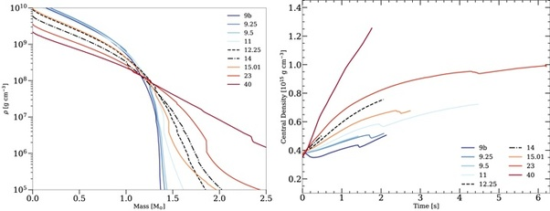

*Réponse publiée [sur Quora](https://fr.quora.com/Peut-on-d%C3%A9river-ou-int%C3%A9grer-une-vitesse-d%C3%A9duite-du-rayon-de-Schwarzschild-si-on-suppose-qu-il-existe-un-certain-temps-entre-la-mort-d-une-%C3%A9toile-de-40-Ms-et-la-naissance-du-TN-qui-en/answer/Dr-Goulu)*

Vous avez un rayon de Schwarzschild dès que la vitesse de libération de la masse à l'intérieur dépasse la vitesse de la lumière.

Lors de l'effondrement de l'étoile, ça arrive dès que la densité de centre dépasse 20 milliards de tonnes par centimètre cube, puis la matière environnante continue à tomber en chute libre, donc quasiment à la vitesse de la lumière, mais le flux de matière est variable car la densité des couches est variable (composition, ondes de choc)

L'article suivant présente une simulation numérique d'un tel effondrement

[https://iopscience.iop.org/artic...](https://iopscience.iop.org/article/10.3847/1538-4357/acfc1c)

D'après cet article, l'effondrement d'une étoile de 40 masses solaires produit un trou noir de 2.5 à 3 masses solaires "seulement" en 6 secondes environ

(évolution de la densité centrale à droite)

D'autre part, la conservation du moment cinétique produit un trou noir de Kerr, en rotation très rapide, pas un trou noir de Schwarzschild.
