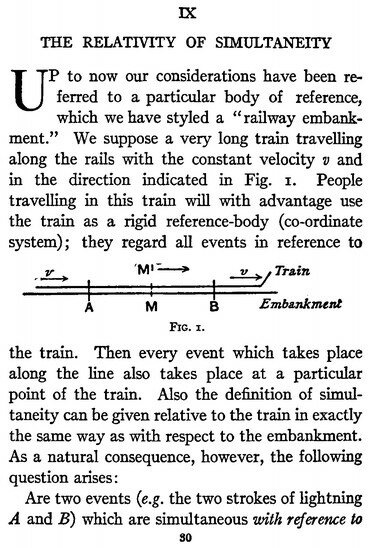

*Réponse publiée [sur Quora](https://fr.quora.com/Quelle-est-votre-source-sur-l-article-einstein-trains/answer/Dr-Goulu)*

C'est dans son livre

**Über die spezielle und die allgemeine Relativitätstheorie**publié en 1916

Voici un extrait de la traduction anglaise

Albert Einstein, Relativity: The Special and General Theory, trans. R. W. Lawson (New York: Henry Holt and Co., 1921).

