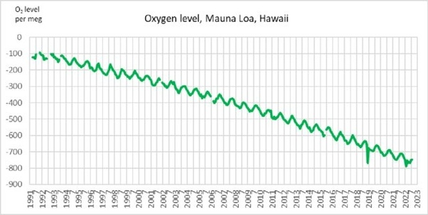

*Réponse publiée [sur Quora](https://fr.quora.com/Pourquoi-le-pourcentage-d-azote-et-d-oxyg%C3%A8ne-dans-l-air-ne-change-pas-ou-tr%C3%A8s-peu-a-cause-de-l-%C3%A9norme-quantit%C3%A9-de-CO2-cr%C3%A9%C3%A9-par-l-homme/answer/Dr-Goulu)*

L'azote il n'y a aucune raison

L'oxygène diminue exactement comme le CO2 augmente.

Mesure du niveau d'oxygène à Hawaï par le programme [Scripps O2](https://scrippso2.ucsd.edu/)

Comme le CO2 a augmenté de 200 ppm, la diminution correspondante d'O2 est faible par rapport au 21% d'oxygène dans l'air.

On crèvera de chaud bien avant de manquer d'oxygène.
