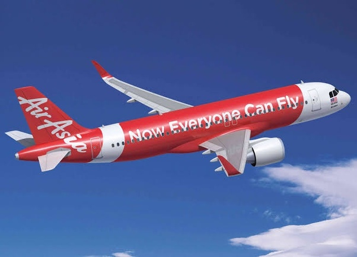

*Réponse publiée [sur Quora](https://fr.quora.com/Pourquoi-les-citoyens-acceptent-de-se-faire-faire-les-poches-par-les-grandes-compagnies-Pourquoi-un-voyageur-doit-payer-des-frais-suppl%C3%A9mentaires-pour-avoir-des-avantages-qui-auparavant/answer/Dr-Goulu)*

Exemple siouplait ?

Votre question me fait penser aux compagnies aériennes low cost qui font payer les bagages en soute et les repas. C'est çà ?

Dans ce cas la réponse est que certains consommateurs (qui ne sont pas forcément des citoyens du pays concerné) préfèrent payer un peu moins s'ils n'utilisent pas ces avantages/droits datant de l'époque où les vols en avion étaient un privilège de riches.

Je viens de voler avec AirAsia, une low cost asiatique dont le slogan m'a fait beaucoup réfléchir et fait sûrement bondir les écolos

"Maintenant tout le monde peut voler"

Un chauffeur de taxi en Thaïlande m'a dit qu'il a pu prendre l'avion pour la première fois de sa vie, avec sa femme, pour aller voir les cerisiers en fleurs au Japon.

Et vous vous pleurnichez parce que vous devez payer votre Coca ?
