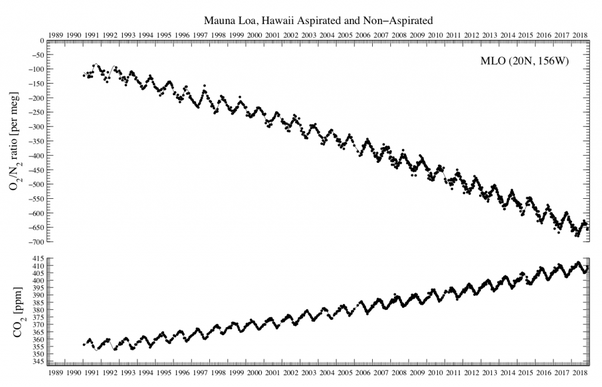

*Réponse publiée [sur Quora](https://fr.quora.com/Le-taux-d-oxyg%C3%A8ne-dans-l-atmosph%C3%A8re-est-il-constant-et-pourquoi/answer/Dr-Goulu)*

Sur le long terme il a beaucoup varié, le taux actuel ne datant que de 540 millions d'années

[https://fr.wikipedia.org/wiki/Hi...](w:Histoire_géologique_de_l'oxygène)

Sur le très court terme, il diminue au fur et à mesure que le CO2 augmente

([ESRL Global Monitoring Laboratory](https://gml.noaa.gov/obop/mlo/programs/coop/scripps/o2/o2.html))

La petite oscillation annuelle est due à la photosynthèse : il y a plus de végétation dans l'hémisphère nord, donc plus d'absorption de CO2 et de dégagement d'O2 pendant notre été.
