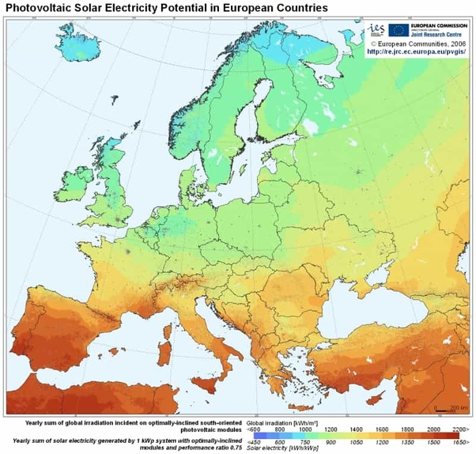

*Réponse publiée [sur Quora](https://fr.quora.com/Est-ce-qu-un-projet-sur-le-principe-Noor-Ouarzazate-est-r%C3%A9alisable-et-viable-en-Europe/answer/Dr-Goulu)*

Oui, il y a d'ailleurs les [Centrales solaired PS10](w:Centrale_solaire_PS10)et[PS20 en Espagne](w:Centrale_solaire_PS20).

Le problème est que le rendement du solaire varie beaucoup avec la latitude

En gros une centrale au Maroc ou dans le sud de l'Espagne produit le double de l'électricité que dans le nord de l'Allemagne.
