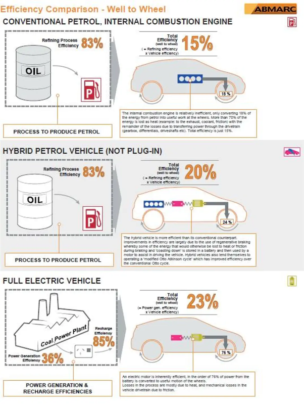

*Réponse publiée [sur Quora](https://fr.quora.com/S-il-faut-6-l-d-essence-100-km-pour-un-v%C3%A9hicule-%C3%A0-moteur-thermique-combien-faut-il-br%C3%BBler-de-litres-de-p%C3%A9trole-en-centrale-thermique-pour-fournir-l-%C3%A9lectricit%C3%A9-correspondante-%C3%A0-un-VE/answer/Dr-Goulu)*

Environ 3,9 litres.

Ça résulte de l'analyse du rendement "well to wheel", du puits de pétrole (ou charbon) aux roues de la voiture.

Ce rendement est de 15% pour une voiture thermique et de 23% pour une voiture électrique, donc 6*0.15/0.23 = 3.9

La raison est double :

- Le rendement d'une centrale thermique est proche du double d'un moteur à explosion
- Un véhicule électrique consomme moins grâce à la récupération d'énergie à la descente et au freinage

Ce n'est évidemment pas ainsi qu'on devrait produire de l'électricité, mais au pire on pourrait capter le CO2 de la centrale thermique beaucoup plus facilement que celui émis par la voiture.
