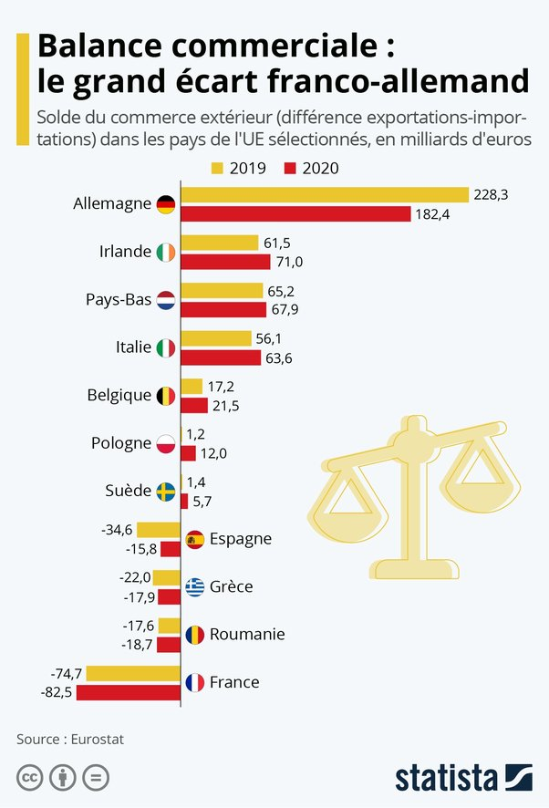

*Réponse publiée [sur Quora](https://fr.quora.com/Pourquoi-les-fran%C3%A7ais-justifient-leurs-monceaux-de-dettes-par-l-influence-catholique-alors-que-les-USA-protestants-sont-encore-pires-Pourquoi-les-Allemands-arrivent-ils-%C3%A0-accepter-d-%C3%AAtre/answer/Dr-Goulu)*

C'est quoi cette histoire d'influence catholique sur la dette ?

> Il est vrai que la trajectoire des finances publiques semble hors de contrôle:
>
>
>
> 1. Creusement structurel du déficit public (déficit primaire de 3,8% du PIB en 2023 après 2,8% en 2022 – le solde primaire correspond au solde budgétaire avant paiement des intérêts de la dette) sans réel effet sur la croissance économique;
> 2. [Déficits jumeaux](w:) structurels (déficit commercial de 2,9% du PIB en 2023);
> 3. Décrochage du ratio des revenus publics (51,8% du PIB en 2023 après 54% en 2022);
> 4. Un poids non soutenable des dépenses publiques (57,3% du PIB en 2023 vs. 55,2% en 2019);
> 5. Un ratio charge d’intérêt/recettes publiques en progression attendue (3,3% en 2023, 5.0% en 2027).
>
>
>
> …
>
>
>
> Le dérapage de la dette publique date en fait de la présidence de François Hollande, la gestion de la pandémie de Covid-19 et la crise énergétique de 2022 ayant été des facteurs aggravants. En 2010, la France et l’Allemagne avaient le même taux d’endettement, proche de 85% du PIB. Depuis, l’écart entre les deux pays s’est creusé à 51% du PIB, l’Allemagne opérant un désendettement vers le seuil de 60% du PIB. Ce derating relatif pourrait remettre en cause le principal bénéfice de l’euro pour la France, à savoir la situation de passager clandestin. En effet, la France a longtemps profité de la discipline budgétaire allemande en termes de prime de risque et de coût de refinancement,

[https://www.allnews.ch/content/p...](https://www.allnews.ch/content/points-de-vue/le-crédit-de-la-france-en-question)

La France et les USA partagent un même gros problème : les "déficits jumeaux". Il n'y a pas que l'Etat qui perd du fric, il y a tout le pays qui importe plus qu'il n'exporte.

La balance commerciale française est la plus déficitaire d'Europe, alors que l'Allemagne est la plus bénéficiaire

([Infographie: Balance commerciale : le grand écart franco-allemand](https://fr.statista.com/infographie/25473/balance-commerciale-pays-ue/))

Et ça ce n'est pas du à votre Etat ou son Président, c'est votre travail dans vos entreprises qui n'est pas assez compétitif pour se vendre à l'étranger. (en général, il y a bien sûr et heureusement des exceptions)

Ce qui a sauvé la France jusqu'ici, c'est que la balance des paiements est restée positive grâce au tourisme et aux investissements (immobiliers) étrangers.

Donc faites bien gaffe à ne pas effrayer les touristes ou saboter leurs vacances à coups de grèves, et remettez vous au boulot 40h par semaine jusqu'à 65 ans comme tout le monde, fonctionnaires compris, et votre Etat pourra peut être commencer à reboucher le trou.
