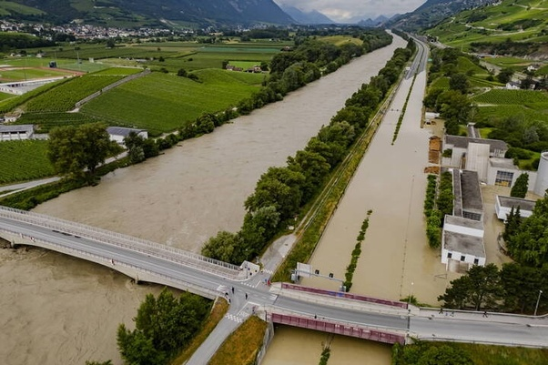

*Réponse publiée [sur Quora](https://fr.quora.com/Que-c-est-il-pass%C3%A9-ce-30-juin-2024-comment-l-expliquez-vous/answer/Dr-Goulu)*

Il y a eu de gros orages qui ont provoqué des laves torrentielles dans les Alpes, 3 morts, et le Rhône a débordé en quelques endroits, inondant même l'autoroute près de chez moi

Ça va devenir de plus en plus fréquent avec le réchauffement climatique.
