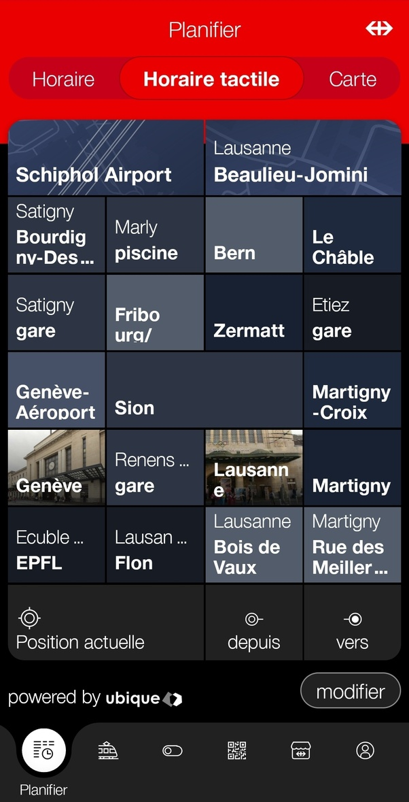
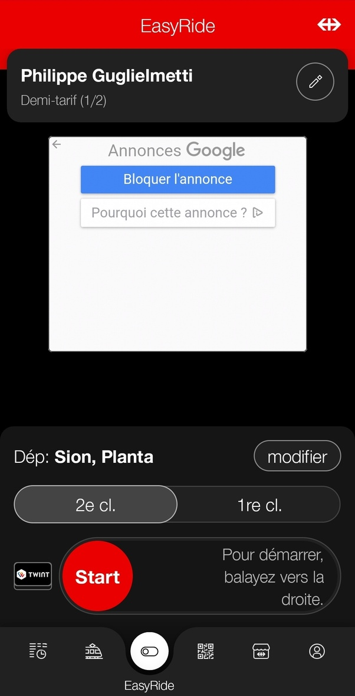

*Réponse publiée [sur Quora](https://fr.quora.com/Quelle-est-la-meilleur-application-qui-est-sp%C3%A9ciale-pour-votre-pays/answer/Dr-Goulu)*

Franchement, l'application des Chemins de Fer Fédéraux (CFF) qui inclut désormais tous les transports publics suisses et certaines lignes internationales est géniale.

Je voyage pas mal, et je n'ai jamais vu mieux ailleurs pour les horaires et l'achat des billets.

Il y a notamment l' "horaire tactile" qui permet de trouver une liaison simplement en traçant du doigt une ligne entre deux gares ou arrêts de bus sur un écran personnalisable :

Interface utilisateur parfaite : simple, claire, rapide.

Et sinon il y a un système ultra simple pour acheter un billet : Easy Ride

Je glisse le bouton rouge à droite en entrant dans le train ou le bus, je prends toutes les correspondances que je veux, et je remets le bouton à gauche à la fin du trajet. Ou de la journée si je fais un aller-retour.

Si vous aviez demandé la pire, j'hésiterais entre la demande de visa du Vietnam ou la réservation TGV de la sncf…
