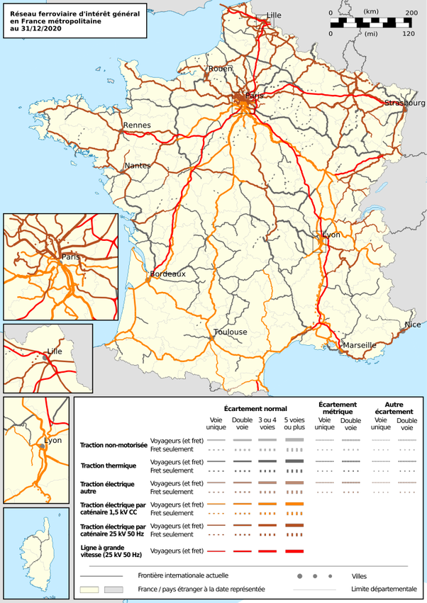
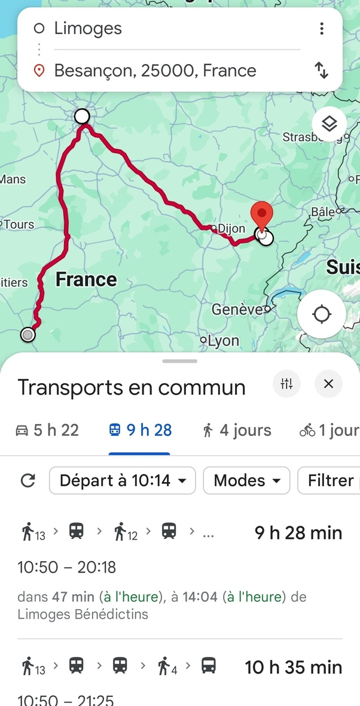
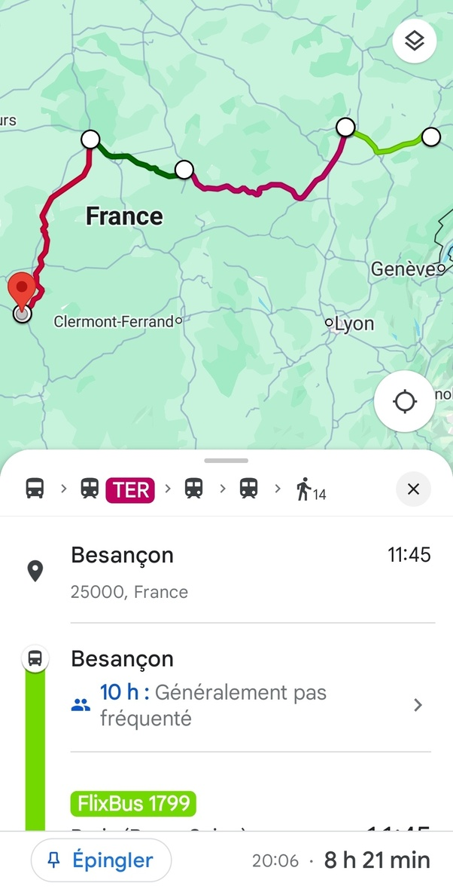

*Réponse publiée [sur Quora](https://fr.quora.com/La-SNCF-cet-op%C3%A9rateur-n-est-il-pas-ignoble-honteux-et-devrait-dispara%C3%AEtre-car-quand-vous-voulez-aller-de-Besan%C3%A7on-%C3%A0-Limoges-il-vous-fait-passer-par-Paris-alors-vous-payez-plus-cher-car/answer/Dr-Goulu)*

Un petit coup d'œil à la carte des voies ferrées :

Tiens, on dirait qu'il y a une légère tendance à la centralisation, chez vous…

Et Google confirme que c'est 1h plus rapide de passer par Paris que par Lyon et Vierzon.

Mais le plus rapide semble être de prendre le bus pour Dijon, puis le train pour Nevers et Vierzon.

Plus rapide, plus court, pour le prix je vous laisse voir…
