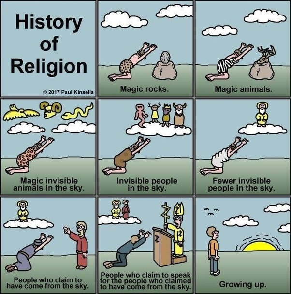

*Réponse publiée [sur Quora](https://fr.quora.com/Pourquoi-l-islam-semble-t-il-%C3%AAtre-plus-critiqu%C3%A9-que-les-autres-religions-Je-veux-dire-Allah-a-dit-que-les-mecreants-critique-l-islam-et-qu-ils-seraient-amen%C3%A9s-en-enfer-donc-et-si-il/answer/Dr-Goulu)*

[Xipe Totec](w:)disait qu'il fallait arracher le cœur encore palpitant des mécréants encore vivants.

Et s'il disait vrai ?

