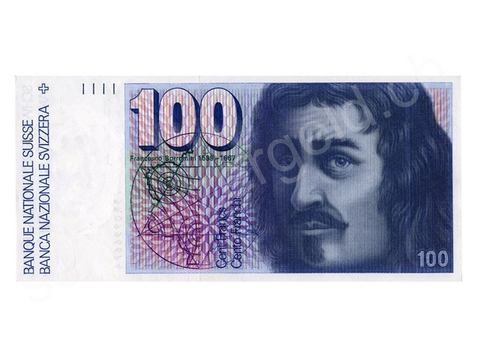

*Réponse publiée [sur Quora](https://fr.quora.com/Quelle-est-la-plus-grosse-somme-d-argent-que-vous-ayez-jamais-trouv%C3%A9e-par-hasard-et-gard%C3%A9e/answer/Dr-Goulu)*

100 francs suisses (environ 100 euro).

Fin des années 1990, j'habitais si près de mon travail que j'y allais à pied. Un matin d'hiver, je marchais vite, emmitouflé dans mon manteau, à la lumière des réverbères, quand j'ai distraitement vu un paquet de cigarettes jeté dans le caniveau.

Je marche encore quelques pas et je me dis "c'est bizarre, ce paquet de cigarettes me regardait…"

Je retourne voir ce qui m'a donné cette drôle d'impression, et je vois un Borromini plié en deux, glissé entre l'étui transparent et le paquet vide.

Un [Borromini](w:Francesco_Borromini), c'était ça :

Un collègue fumeur me confirme que c'est l'habitude de certains, vu la compatibilité du format…

Je pense qu'un automobiliste mal réveillé aussi avait distraitement jeté son précieux paquet de cigarettes par la fenêtre de son véhicule.

Aucun moyen de le retrouver + découragement de mauvaises habitudes = je garde le billet.
