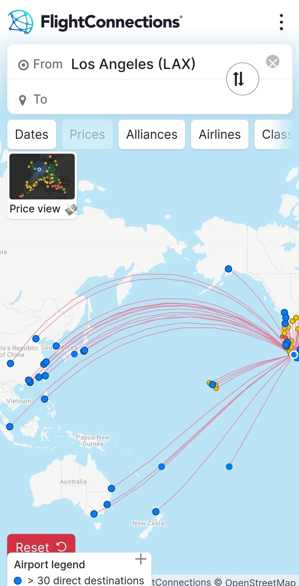

*Réponse publiée [sur Quora](https://fr.quora.com/Pourquoi-on-peut-pas-voler-de-l-Ouest-de-l-Am%C3%A9rique-vers-l-Asie-Je-veux-une-r%C3%A9ponse-scientifique-concernant-la-rondeur-de-la-terre/answer/Dr-Goulu)*

