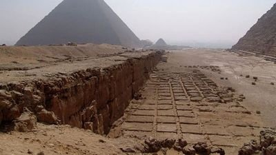

*Réponse publiée [sur Quora](https://fr.quora.com/Lorsque-les-premi%C3%A8res-pyramides-d-%C3%89gypte-ont-%C3%A9t%C3%A9-b%C3%A2ties-est-ce-que-l-%C3%A8re-glaciaire-%C3%A9tait-termin%C3%A9e-et-si-la-r%C3%A9ponse-est-n%C3%A9gative-cela-ne-change-t-il-pas-le-probl%C3%A8me-du-transport/answer/Dr-Goulu)*

Pour compléter les autres réponses, les pyramides ont été construites principalement avec du calcaire extrait sur place.

La carrière de Gizeh, juste à côté.

Seuls les matériaux "nobles" de décoration venaient de loin.

[https://fr.wikipedia.org/wiki/Ca...](w:Carrières_de_pierres_dans_l'Égypte_antique)
