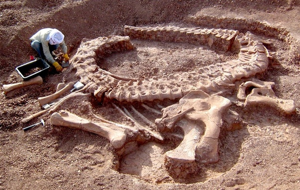

*Réponse publiée [sur Quora](https://fr.quora.com/Comment-sont-expliqu%C3%A9s-les-dinosaures-dans-la-religion/answer/Dr-Goulu)*

Quelle religion ? Dans plein de traditions différentes il y a des dragons, des serpents géants, des démons monstrueux etc.

Imaginez que vous vous baladez dans le désert du Niger il y a quelques siècles et que vous trouviez ça :

vous en déduiriez quoi ?
