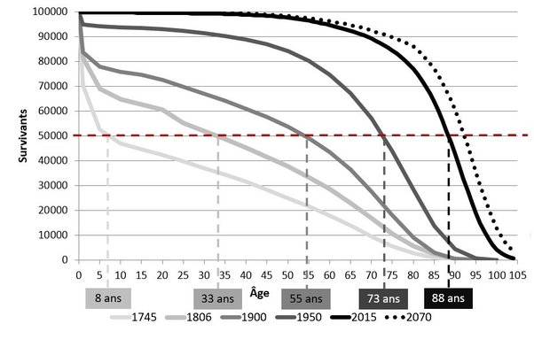

*Réponse publiée [sur Quora](https://fr.quora.com/Alors-que-l-esp%C3%A9rance-de-vie-a-progress%C3%A9-de-30-ans-en-1-si%C3%A8cle-vivre-jusqu-%C3%A0-110-ans-deviendra-t-il-la-norme-pour-nos-arri%C3%A8re-petits-enfants/answer/Dr-Goulu)*

Non. Ce qui se passe c'est la "rectangularisation de la Courbe de survie" [[1]](#hjGKI) :

De moins en moins de gens meurent "jeunes", donc l'âge au décès médian augmente et se rapproche de plus en plus de la limite biologique (110 ans si vous voulez)

En 2070 en France vous devriez (si tout va bien…) avoir la moitié de la population qui décède après 92 ans, mais toujours très peu de gens dépassant 105 ans.

Notes de bas de page

[[1]](#cite-hjGKI)[DemoGoT - Courbes de survie](https://www.demographie-got.com/demo_courbes.html)
