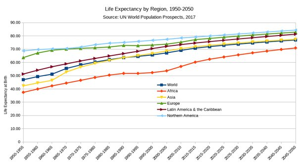

*Réponse publiée [sur Quora](https://fr.quora.com/L-homme-est-il-devenu-le-pire-ennemi-de-la-Pollution-par-plastique-m%C3%A9taux-lourds-m%C3%A9dicaments-radioactivit%C3%A9-environnement-%C3%A9lectromagn%C3%A9tique-etc-sont-la-cause-de-l-accroissement-de/answer/Dr-Goulu)*

Si c'était vrai, il faudrait expliquer ça :

Et pourquoi les pays moins industrialiséa ont la plus faible espérance de vie…

Il faut quand même être sacrément ingrat pour ranger les médicaments avec les polluants alors que vous êtes probablement vivant grâce à eux.
