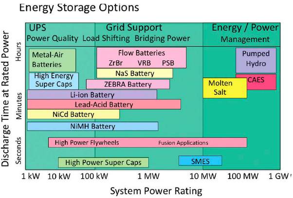

*Réponse publiée [sur Quora](https://fr.quora.com/Les-g%C3%A9n%C3%A9rateurs-diesel-sont-polluants-et-co%C3%BBteux-et-les-batteries-pour-panneaux-solaires-%C3%A9galement-surtout-dans-les-pays-chauds-Quelles-sont-les-alternatives-pour-le-stockage-d-%C3%A9nergie/answer/Dr-Goulu)*

Comme le dit [Jacques-Marie Moranne](https://fr.quora.com/profile/Jacques-Marie-Moranne), il faut chiffrer votre "moyenne échelle" en puissance de charge (de vos panneaux) et en durée de stockage (à priori une nuit pour du solaire)

En écrivant

[https://drgoulu.com/2012/10/07/c...](/2012/10/07/comment-stocker-lenergie/)

j'étais tombé sur un graphique intéressant décrivant les techniques de stockage sur ces deux axes :

Une solution méconnue pour stocker des centaines de kWh est la

[https://fr.wikipedia.org/wiki/Ba...](w:Batterie_à_flux_redox)

Les batteries ne sont pas polluantes, elles se recyclent très bien. Mais elles sont "chères", en effet ça double ou triple le prix d'une installation solaire…

Puisque vous mentionnez les "pays chauds", je ne vois pas quelle différence ça ferait, mais ça me fait penser au stockage par sels fondus utilisé dans certaines [Centrales solaires thermodynamiques](w:Centrale_solaire_thermodynamique). Pour un prix par kWh inférieur au photovoltaïque+batterie, l'idée est de stocker la chaleur solaire, et d'en tirer de l'électricité à la demande. Mais ça ne marche bien qu'en grand.
