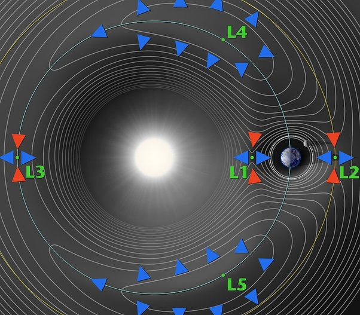

*Réponse publiée [sur Quora](https://fr.quora.com/Pourquoi-les-points-de-Lagrange-L1-et-L2-sont-ils-dits-instables-contrairement-aux-points-L4-et-L5-do%C3%B9-provient-cette-instabilit%C3%A9/answer/Dr-Goulu)*

Ce dessin sur [Point de Lagrange - Wikipedia](w:Point_de_Lagrange)montre que L1, L2 et L3 sont des "points selle" du potentiel gravitationnel : si un objet s'écarte du point, le potentiel le ramène dans la direction des flèches rouges, mais l'éloigne dans le sens des flèches bleues.

Intuitivement, si un objet est en équilibre entre deux astres mais se rapproche un peu de l'un d'eux, il sera attiré de plus en plus vers celui-ci.

La situation de L4 et L5 est différente : selon le dessin ils sont situés sur un plateau de potentiel, donc légèrement instables dans toutes les directions du plan.

Mais… Mais tout ça tourne, et ça change tout. Les calculs (pas simples) sont dans l'article Wikipedia, mais en résumé

> de façon plus surprenante, un point de Lagrange peut être stable s'il correspond à un maximum local du potentiel, c'est-à-dire que Ω,*xx* + Ω,*yy*peut être négatif, pourvu que cette quantité ne dépasse pas la valeur critique de -4 *ω*2. En pratique, c'est ce qui se produit dans certains cas pour les points de Lagrange L4 et L5.
>
>
>
> L'interprétation physique de cette situation est que la stabilité est alors assurée par la force de Coriolis. Un objet légèrement décalé d'un tel point va s'en éloigner dans un premier temps en façon radiale, avant de voir sa trajectoire incurvée par la force de Coriolis. Si le potentiel est partout décroissant autour du point, alors il est possible que la force de Coriolis force l'objet à tourner autour du point de Lagrange

Donc c'est plutôt la stabilité de L4 et L5 qui est étonnante, alors que l'instabilité de L1, L2 et L3 est assez intuitive.
