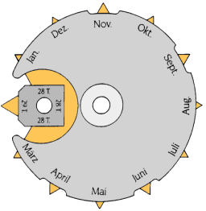

*Réponse publiée [sur Quora](https://fr.quora.com/Comment-une-montre-m%C3%A9canique-avec-fonction-date-fait-pour-g%C3%A9rer-le-mois-de-f%C3%A9vrier-et-les-ann%C3%A9es-bissextiles/answer/Dr-Goulu)*

C'est tout bien expliqué là, avec dessins

[https://archive.horlogerie-suiss...](https://archive.horlogerie-suisse.com/Complications/Chap8.htm)

Le principe est d'avoir une roue qui tourne en un an avec des encoches pour les 30/31 jours et un élément pour février qui tourne sur lui-même en 4 ans et produit une encoche plus profondes pour 28/29 jours :

Après il y a un mécanisme futé de ressorts et leviers qui font avancer la date à minuit en lisant ces encoches.
