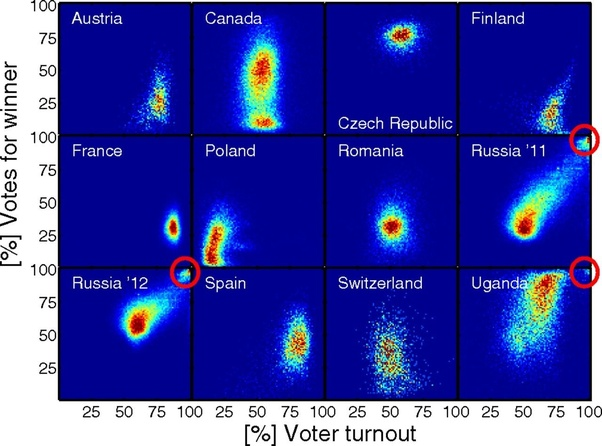

*Réponse publiée [sur Quora](https://fr.quora.com/Des-doutes-sur-les-election-Fraude-%C3%A9lectorale-Cela-pourrait-inclure-des-votes-multiples-o%C3%B9-une-m%C3%AAme-personne-voterait-plusieurs-fois-ou-lutilisation-de-fausses-identit%C3%A9s-quelles-sont-vos/answer/Dr-Goulu)*

C'est des broutilles.

Avant de détailler, je vais préciser que j'ai été membre de la Commission électorale centrale du canton de Genève pendant plusieurs années en tant qu'expert indépendant (= sans parti) en informatique, et chargé d'examiner les tests statistiques de fraude électorale qui étaient utilisés l'époque.

En Suisse on vote environ quatre fois par année sur une dizaine de référendums et d'initiatives populaires, et à Genève ce sont environ 300'000 votants qui expriment leur vote à plus de 80 % par correspondance.

Chaque citoyen reçoit à domicile une carte de vote individuelle qu'il authentifie simplement en indiquant sa date de naissance et sa signature. Il est donc assez facile à une personne mal intentionnée de récupérer les cartes de vote de membres de sa famille qui s'abstiennent, ou celles de pensionnaire d'un EMS (=EHPAD) dans lequel il travaille, ou même, comme c'est arrivé, dans les poubelles à papier de son quartier où les gens qui s'abstiennent jettent leur matériel inutilisé.

Mais ceci est totalement anecdotique puisqu'il faudrait au moins 3000 votes frauduleux pour ajouter 1% de oui ou de non lors d'un référendum, et que ceci a peu de chance de changer l'issue du vote surtout si l'on part de l'idée qu'un nombre à peu près équivalent de fraudeurs font de même dans l'autre camp.

Si ce nombre devient non anecdotique en raison d'une fraude massive et organisée, elle peut être détectée assez facilement. Un très bon article sur la détection de fraude électorale est intitulé en anglais [1]

> ce n'est pas le vote qui fait la démocratie, c'est le dépouillement.

Ceci me paraît extrêmement important. En réalité les fraudes électorales efficaces sont celles perpétrées lors du dépouillement par les autorités en place dans les pays qui n'ont pas d'instruments démocratiques de surveillance du vote ou d'observateurs internationaux

Dans ces cas, la technique la plus simple est celle du bourrage d'urne consistant à ajouter un grand nombre de votes fictifs pour changer le résultat du vote, qui est parfaitement connu puisque le dépouillement des bulletins valides a déjà été effectué.

Il existe cependant une méthode extrêmement simple pour mettre en évidence ce genre de fraude : il suffit de faire une représentation graphique des résultats de chaque bureau de vote ou circonscription en mettant un point à l'abscisse correspondant à la participation et en ordonnée le score du vote.

Si on observe un nuage de points autour du score définitif tout va bien. Il se peut qu'on obtienne un nuage de points étalé, voire deux nuages de points l'un au dessous de l'autre dans le cas de différences géographiques ou culturels dans un même pays, mais si on observe une tache proche de 100 % de participation pour un score à 100 % favorable, le bourrage d'urne est quasiment évident.

Vous pouvez distinguer facilement ces différents cas sur le graphique ci-dessous tirer de l'article mentionné.

1. Peter Klimek, Yuri Yegorov, Rudolf Hanel, & Stefan Thurner (2012). It’s not the voting that’s democracy, it’s the counting: Statistical detection of systematic election irregularities *PNAS* DOI: [10.1073/pnas.1210722109](http://dx.doi.org/10.1073/pnas.1210722109) [(pdf)](http://arxiv.org/pdf/1201.3087.pdf)

[https://fr.slideshare.net/Goulu/...](https://fr.slideshare.net/Goulu/indicateurs-statistiques-de-fraude-lectorale)
