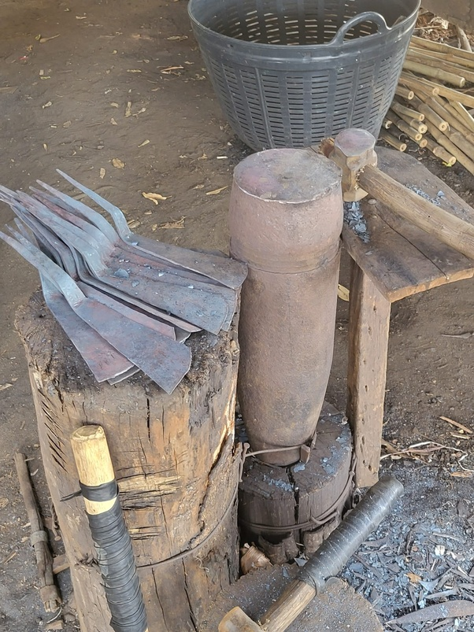

*Réponse publiée [sur Quora](https://fr.quora.com/Est-ce-que-les-carcasses-des-tanks-sont-r%C3%A9cup%C3%A9r%C3%A9es-sur-les-champs-de-bataille-pour-ce-qu-on-peut-r%C3%A9cup%C3%A9rer-fer-par-exemple/answer/Dr-Goulu)*

Oui bien sur.

Atelier de forgeron laotien. L'enclume est un obus trouvé dans un champ, et la matière des lames ressort de camions...
