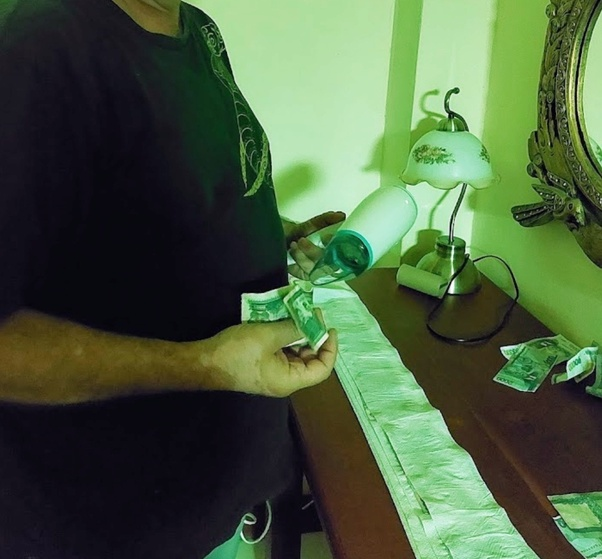

*Réponse publiée [sur Quora](https://fr.quora.com/Comment-laver-les-billets-de-banque/answer/Dr-Goulu)*

A l'eau.

En ressortant d'une piscine au Laos je me suis rendu compte que j'avais gardé mon porte monnaie dans la poche de mon short de bain…

Et dedans, un million de kips tous frais sortis du distributeur…

Heureusement, même dans ce pays assez pauvre, les billets de banque sont désormais plus en plastique qu'en papier, donc après les avoir déposés entre des couches de papier toilette, un petit coup de sèche-cheveux les a rendus aussi propres que la pièce fétiche de l'oncle Picsou :

