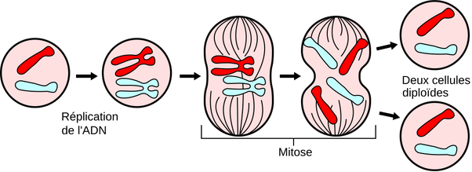

*Réponse publiée [sur Quora](https://fr.quora.com/Deux-mitose-successives-donnent-4-cellules-a-partir-d-une-si-la-premi%C3%A8re-a-20-chromosomes-chacune-des-nouvelles-cellules-en-aura-combien/answer/Dr-Goulu)*

20 aussi. L'ADN est répliqué

[Mitose — Wikipédia](w:Mitose)
