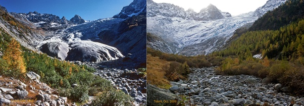

*Réponse publiée [sur Quora](https://fr.quora.com/Quel-a-%C3%A9t%C3%A9-l%C3%A9volution-du-climat-pour-vous-depuis-votre-jeunesse-jusqu%C3%A0-aujourdhui-Pas-par-des-r%C3%A9f%C3%A9rences-%C3%A0-des-%C3%A9tudes-ou-des-ouvrages-mais-par-votre-t%C3%A9moignage-de-faits-issus-de/answer/Dr-Goulu)*

Depuis 1973 environ je suis allé au moins une fois par année au [Glacier du Trient](w:), situé au dessus de ma ville natale, Martigny.

Au 19ème siècle on y extrayait de la glace acheminée par un chemin quasi horizontal au [Col de la Forclaz](w:Col_de_la_Forclaz_(Valais)), 1527m d'altitude. C'était un des glaciers alpins les plus faciles d'accès.

La photo de gauche date de 1978, elle correspond à mes souvenirs d'enfance et d'adolescence : depuis le bout du chemin horizontal où se trouve une buvette et le coin pique nique du dimanche, on montait encore un chemin sur environ 300m avant d'atteindre la langue du glacier :

La photo de droite date de 2009 (source [Effet du réchauffement climatique sur le Trient — Randos-MontBlanc](https://www.randos-montblanc.com/insolite/rechauffement-climatique-trient.html)) et je peux vous dire qu'en 2024 c'est encore nettement pire : il n'y a plus de langue glaciaire, le glacier a reculé de plusieurs kilomètres dans la paroi rocheuse, inaccessible.
