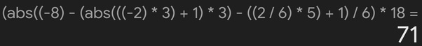

*Réponse publiée [sur Quora](https://fr.quora.com/Comment-calculer-8-2313-2-651-618/answer/Dr-Goulu)*

Ah les valeurs absolues sont imbriquées…

vous n'avez qu'à le taper dans Google et il vous explique comment ça se calcule

