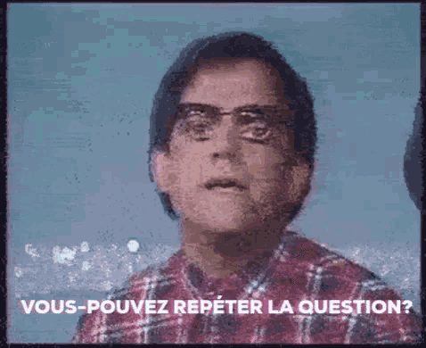

*Réponse publiée [sur Quora](https://fr.quora.com/Si-le-chemin-du-m%C3%A2le-alpha-est-toujours-le-sien-peut-il-vraiment-%C3%AAtre-perdu-ou-est-ce-simplement-l-univers-qui-attend-qu-il-le-red%C3%A9finisse/answer/Dr-Goulu)*

.
