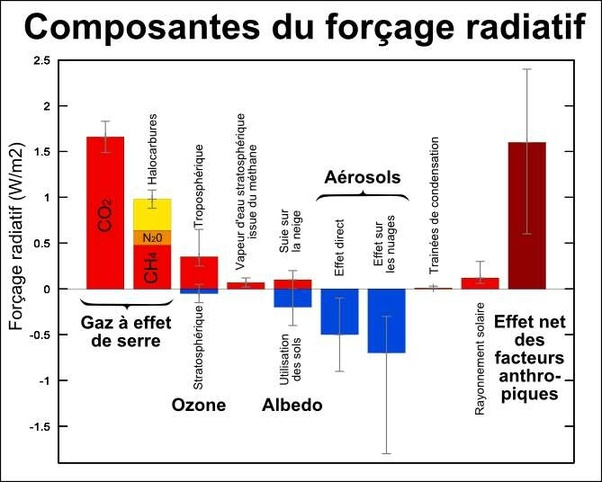

*Réponse publiée [sur Quora](https://fr.quora.com/Pensez-vous-que-le-changement-climatique-est-caus%C3%A9-uniquement-par-les-activit%C3%A9s-humaines-entra%C3%AEnant-une-augmentation-des-concentrations-de-gaz-%C3%A0-effet-de-serre-dans-l-atmosph%C3%A8re/answer/Dr-Goulu)*

Ce que je pense n'a aucune importance.

Des centaines de scientifiques de tous les pays du monde ont établi avec certitude que le réchauffement climatique est quasi totalement causé par l'activité humaine (y compris des facteurs refroidissants d'ailleurs)

Aucun climatosceptique n'a jamais pu répondre à cette question toute simple : si ce n'est pas ça, d'où vient l'énergie qui nous réchauffe ?
