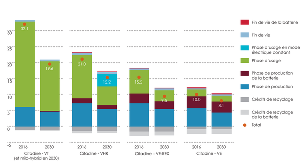

*Réponse publiée [sur Quora](https://fr.quora.com/Concernant-les-voitures-les-medias-d%C3%A9noncent-la-phase-de-fabrication-comme-source-de-pollution-principale-Mais-pourquoi-n-est-il-pas-tenu-compte-de-la-pollution-g%C3%A9n%C3%A9r%C3%A9e-par-l-extraction/answer/Dr-Goulu)*

Aucun media sérieux ne prétend que la fabrication est la source de pollution principale d'une voiture à essence ou diesel.

Les chiffres sont connus et publics depuis longtemps.

[https://www.usinenouvelle.com/ar...](https://web.archive.org/web/20231020101737/https://www.usinenouvelle.com/article/selon-l-ademe-la-voiture-electrique-est-bien-meilleure-pour-le-climat-que-celles-roulant-a-l-essence-ou-au-diesel.N650859)
