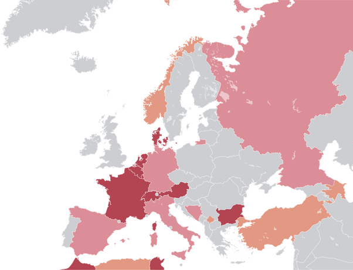

*Réponse publiée [sur Quora](https://fr.quora.com/%C3%8Ates-vous-d-accord-ou-pas-d-accord-avec-l-interdiction-de-la-burqa-en-France/answer/Dr-Goulu)*

Ce n'est pas la burqa qui est interdite.

La [LOI n° 2010-1192 du 11 octobre 2010](https://web.archive.org/web/20240930221402/https://www.legifrance.gouv.fr/jorf/id/JORFTEXT000022911670)dit clairement :

> Nul ne peut, dans l'espace public, porter une tenue destinée à dissimuler son visage.

De nombreux pays européens ont des lois similaires

(source et légende : [Loi interdisant la dissimulation du visage dans l'espace public — Wikipédia](w:Loi_interdisant_la_dissimulation_du_visage_dans_l'espace_public))

L'identité est à la base des sociétés libres. Je veux savoir à qui j'ai affaire dans mon pays, pouvoir reconnaître une personne au besoin. Sauf pendant le carnaval à la rigueur.
