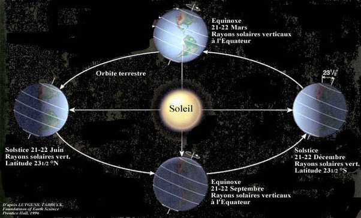

---

title: L' axe de rotation de la terre est incliné de 23,5 degrés par rapport au plan de l'écliptique. Quelqu'un peut-il me dire d'où viennent ces 23,5 degrés si possible par une démonstration mathématique. Merci ?
slug: l-axe-de-rotation-de-la-terre-est-incline-de-23-5-degres-par-rapport-au-plan-de-l-ecliptique-quelqu-un-peut-il-me-dire-d-ou-viennent-ces-23-5-degres-si-possible-par-une-demonstration-mathematique-merci
date: '2024-04-21'
draft: true
categories:
- Quora
tags: []
coverImage: ./images/qimg-83ee52223eb69502afd3876fd6eae40d.jpg
---

*Réponse publiée [sur Quora](https://fr.quora.com/L-axe-de-rotation-de-la-terre-est-inclin%C3%A9-de-235-degr%C3%A9s-par-rapport-au-plan-de-l-%C3%A9cliptique-Quelqu-un-peut-il-me-dire-d-o%C3%B9-viennent-ces-235-degr%C3%A9s-si-possible-par-une-d%C3%A9monstration/answer/Dr-Goulu)*

Ben vous mesurez la hauteur du soleil dans le ciel à midi au solstice d'été (21 juin) et au solstice d'hiver (21 décembre), vous faites la différence et hop ! Vous trouvez 47 degrés.

Alors vous prenez une pomme et une lampe pour essayer de comprendre et vous faites des petits dessins pour essayer de comprendre ce qui pourrait correspondre à vos observations jusqu'à ce que vous tombez sur ça :

Pourquoi 23.5 degrés ? Ben pourquoi pas ?
