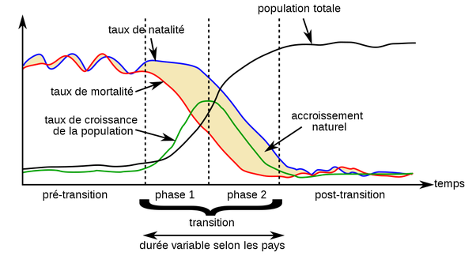

---

title: Puisqu'il faut un homme et une femme pour faire un enfant, qu'il y a les contraceptifs et que les nations modernes ont tendance à réduire le nombre d'enfants, comment expliquer la surpopulation mondiale ?
slug: puisqu-il-faut-un-homme-et-une-femme-pour-faire-un-enfant-qu-il-y-a-les-contraceptifs-et-que-les-nations-modernes-ont-tendance-a-reduire-le-nombre-d-enfants-comment-expliquer-la-surpopulation-mondiale
date: '2024-02-26'
draft: true
categories:
- Comment
tags: []
coverImage: ./images/qimg-89489f59a2e98b83db7d3d1eec896c7d.png
---

*Réponse publiée [sur Quora](https://fr.quora.com/Puisqu-il-faut-un-homme-et-une-femme-pour-faire-un-enfant-qu-il-y-a-les-contraceptifs-et-que-les-nations-modernes-ont-tendance-%C3%A0-r%C3%A9duire-le-nombre-d-enfants-comment-expliquer-la/answer/Dr-Goulu)*

L'augmentation de la population mondiale est due environ à 50% aux nouvelles naissances, et à 50‰ à l'accroissement de l'espérance de vie, donc au fait qu'il y a (temporairement) moins de morts.

L'accroissement de population est du au décalage entre la baisse de mortalité et la baisse de natalité.

Le phénomène s"appelle la [Transition démographique](w:) et il a lieu partout, juste décalé dans le temps. Dans les pays industrialisés on est à la fin du phénomène, en Afrique plutôt au début, en Inde

Hans Rosling explique ça merveilleusement bien avec des boîtes, à 11:00 de cette conférence géniale :


