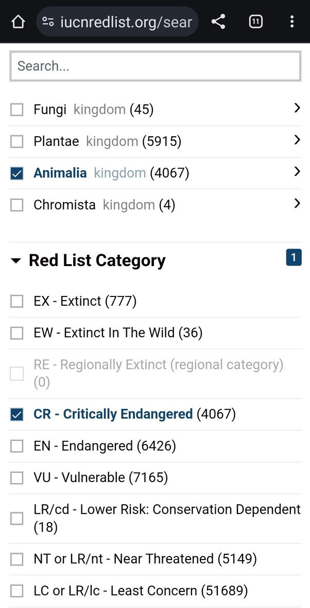
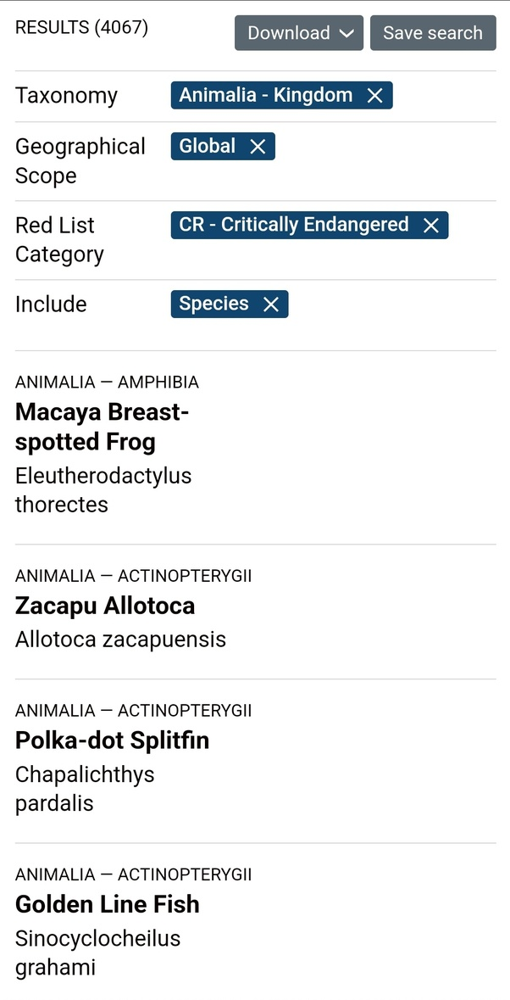
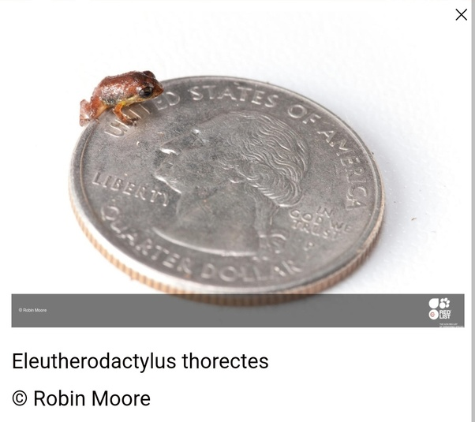

*Réponse publiée [sur Quora](https://fr.quora.com/Quels-sont-les-animaux-en-danger-dextinction/answer/Dr-Goulu)*

Vous allez sur [https://www.iucnredlist.org/search](https://web.archive.org/web/20240807180628/https://www.iucnredlist.org/search), vous choisissez la recherche avancée, vous choisissez le royaume animal dans la taxonomie, et les niveaux de menace souhaités :

4067 espèces en danger critique d'extinction sont immédiatement listées plus bas,

Vous pouvez cliquer sur n'importe quelle espèce pour trouver toutes les infos et obtenir une jolie photo souvenir

